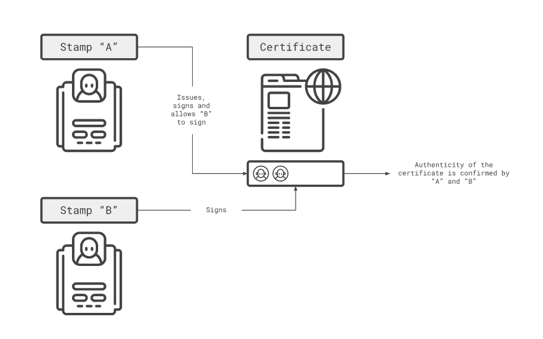

# Discover Vaulth

<figure><figcaption></figcaption></figure>

## Genesis
Vaulth is a project started by students developers at EPITECH (Lyon, France) as part of the Epitech Innovative Project.
  Our starting point was finding how we can help people with real-life authentication concerns use the security of blockchain technology.
  We found out vaulth idea that is a solution which able you to create secure digital certificate for physical artwork like painting.

## Vision
Vaulth aims to provide tooling for real-world use of blockchain technology to attest the of authenticity of assets. We are effectively digitizing certificates of authenticity and signatures, and providing the necessary tooling for their use cases. Our goal is to maximize the real-world utility of decentralized certificates.

## Concepts
We built our tech stack on the analogy of certificates and entity seals. A user who want to issue or sign certificates have to mint their personal seal, a representation who they want to represent (person, institution, company, etc...) which they can use to approve certificates. A certificate is an NFT extended with signability features that allows the creator to allow other seals to sign their certificate.

<figure><figcaption></figcaption></figure>
