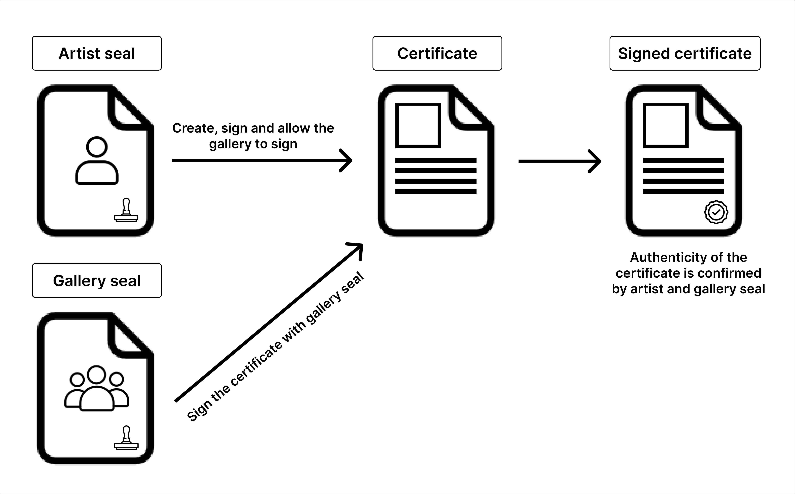

# Discover Vaulth

<figure><figcaption></figcaption></figure>

## Genesis
Vaulth is a project started by students developers at EPITECH (Lyon, France) as part of the Epitech Innovative Project. 
Our starting point was finding how we can help people with real-life authentication concerns use the security of blockchain technology. 
We found out vaulth idea that is a solution which able everyone to create secure digital certificate for differentes type of physical artwork.

## Vision
Vaulth aims to provide tooling for real-world use of blockchain technology to attest the authenticity of physical artwork. 
We are effectively digitizing certificates of authenticity and signatures, and providing the necessary tooling for their use cases. 
Our goal is to maximize the real-world utility of decentralized certificates.

## Concepts
We built our tech stack on the analogy of certificates and entity seals usually used like proof of authenticity. 
An user who want to issue or sign certificates have to mint their personal seal, a representation of a (person, institution, company, etc...) and be use to approve certificates. 
A certificate is an NFT extended with signability features that allows the creator to allow other seals to sign their certificate.

<figure><figcaption></figcaption></figure>

## Platforms
Vaulth is based on 3 differents plaforms, a vitrine website to find more information about us, a dashboard website to manage your seals and certificates and a mobile application to easily connect your certificate with your piece of art.
* [Vitrine website](https://vaulth.app/)
* [Dashboard website](https://www.dashboard.vaulth.app/)
* [Mobile app](https://play.google.com/store/apps/details?id=com.vaulth)