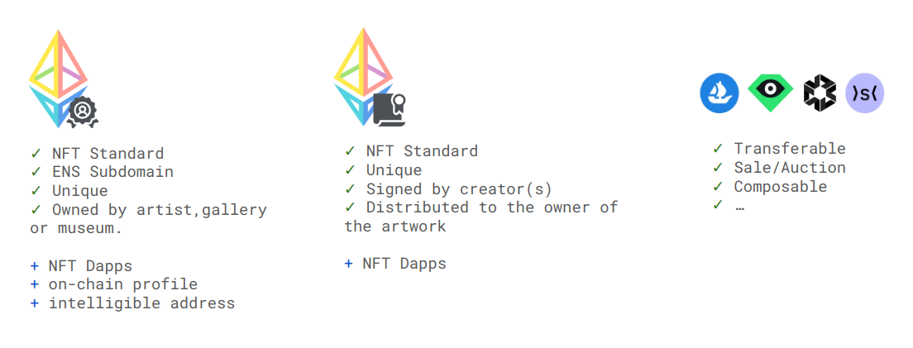
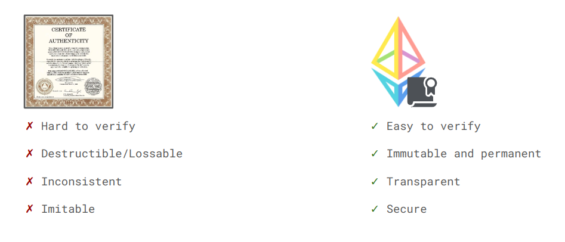
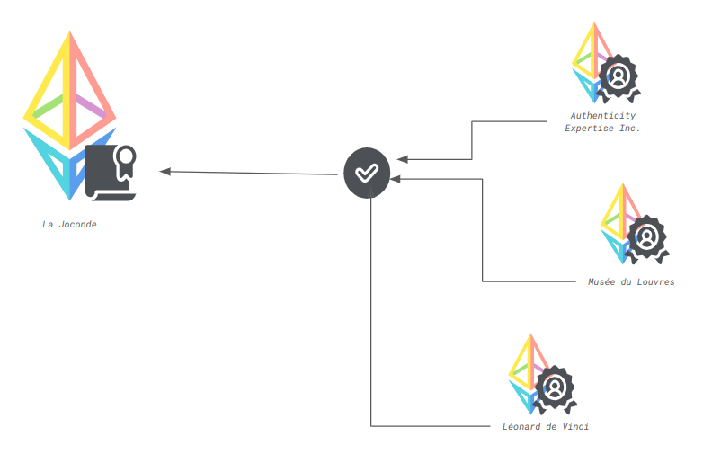

# Discover Vaulth

<figure><figcaption></figcaption></figure>

### Welcome to Vaulth: Where Creativity Meets Blockchain Authenticity

Discover Vaulth, a creation born from the aspirations of student developers at EPITECH (Lyon, France) as part of the Epitech Innovative Project.
Join us as we delve into the genesis, vision, and concept that define Vaulth's mission to empower artists and elevate the world of art authentication.

## Genesis
Vaulth finds its roots in the minds of student developers at EPITECH (Lyon, France) who embarked on a journey within the realm of the Epitech Innovative 
Project. Motivated by the quest to provide pragmatic solutions to real-world authentication concerns, our exploration led us to the synergy of blockchain technology. 
Vaulth emerged as an ingenious solution, empowering individuals across diverse artistic spheres to create secure digital certificates for a myriad of physical 
artworks.

<figure><figcaption></figcaption></figure>

## Vision
Vaulth stands as a beacon, illuminating the path towards realizing the full potential of blockchain technology in the realm of art authenticity. Our compass points 
towards a future where the tangible and the digital converge harmoniously. By digitizing certificates of authenticity and signatures, we forge a bridge between the
traditional and the modern. Our overarching goal is to amplify the efficacy of decentralized certificates, elevating them from mere tokens to indispensable tools for
safeguarding creativity.

<figure><figcaption></figcaption></figure>

## Concept
Vaulth is a concept inspired by the tangible world of certificates and stamps. Much like their real-world counterparts, our digital iteration demands the creation of personal stamps—distinctive imprints representing individuals, institutions, or entities. These stamps wield the power to authenticate certificates. A certificate, an extension of the NFT paradigm, not only embodies the essence of authenticity but also embraces the innovative ability to be endorsed by various stamps. This synergy amplifies the narrative of trust and authentication within the art ecosystem.

* Certificates: In the realm of Vaulth, a certificate is not merely a testament of authenticity; it's a digital testament intertwined with the power of blockchain. An extension of the NFT concept, each certificate is a unique representation of an artwork's provenance. But it goes further—certificates in Vaulth are dynamic, living entities that can be endorsed by various stamps, enhancing their credibility and enriching the narrative of each piece.

* Stamps: Imagine a seal of trust that transcends time and geography. A stamp in Vaulth is an encapsulation of identity and validation. It's a representation of an individual, an institution, or an entity that bestows its endorsement upon certificates. Stamps play a pivotal role in confirming authenticity, and just as a physical stamp leaves an indelible mark, digital stamps within Vaulth carry the weight of trust and provenance.

Together, certificates and stamps compose the cornerstone of Vaulth's ecosystem, forging a path where authenticity and innovation converge harmoniously.

<figure><figcaption></figcaption></figure>

## Platforms
Experience the seamless world of Vaulth through three interconnected platforms, each designed to empower you in different ways:

* Vaulth [Vitrine website](https://vaulth.app/): Discover more about us and the transformative potential of blockchain technology in art authentication. Visit our 
Vitrine website to gain deeper insights into our mission and explore the possibilities.

* Vaulth [Dashboard website](https://www.dashboard.vaulth.app/): Take control of your authenticity journey with our Dashboard website. Seamlessly manage your stamps 
and certificates, and witness the fusion of innovation and security as you navigate your way through the art world.

* Vaulth [Mobile application](https://play.google.com/store/apps/details?id=com.vaulth): Access the world of Vaulth from the palm of your hand. Our Mobile application 
offers unparalleled convenience, allowing you to effortlessly connect your certificates with your treasured pieces of art. Elevate your art authentication experience 
anytime, anywhere.

Explore our platforms and embrace the future of art authentication with Vaulth.