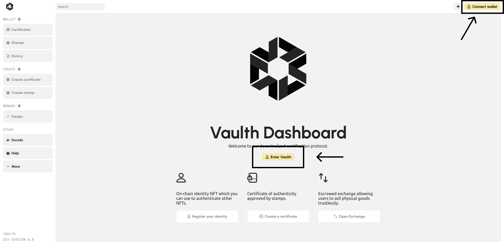
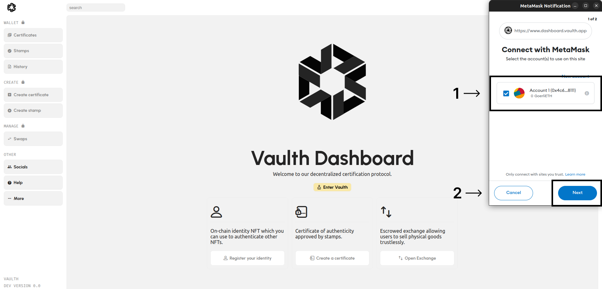
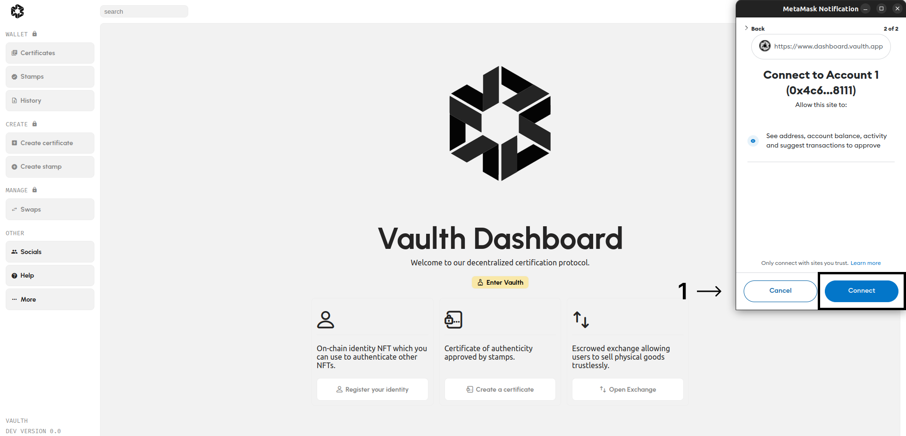
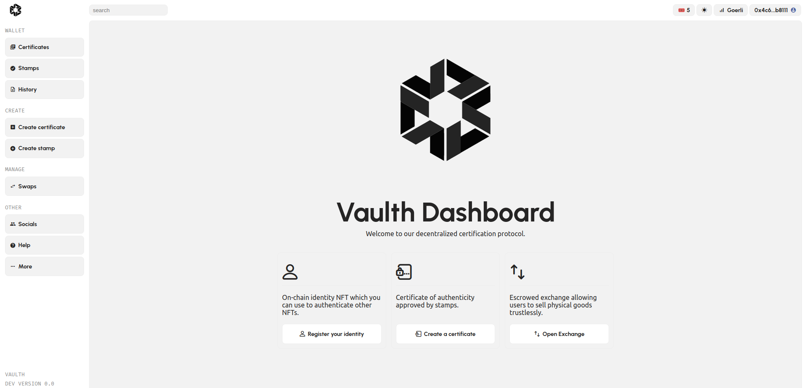

# Connect to Vaulth dashboard

Go to vaulth dashboard by clicking [here](https://www.dashboard.vaulth.app).

### Connect
Once the dashboard is open into a navigator you should click on "Connect wallet" or "Enter vaulth".
<figure><figcaption></figcaption></figure>

### Metamask browser extention
To connect on the dashboard you should have a Metamask account and the browser extention.
If you don't have, you can go [here](https://metamask.io/) to create one.

### Configuration
When you have the Metamask browser extention you can select an account that you will connect with.
<figure><figcaption></figcaption></figure>

Click on connect to accept giving to vaulth dashboard your address, balances and activity wallet.
<figure><figcaption></figcaption></figure>

Great job, you are now connected on the vaulth dashboard !
<figure><figcaption></figcaption></figure>

You can start to create your first seal by visiting the [next page](create-your-certificate.md).