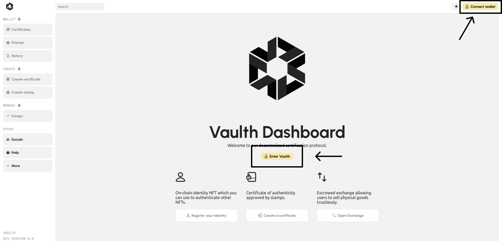
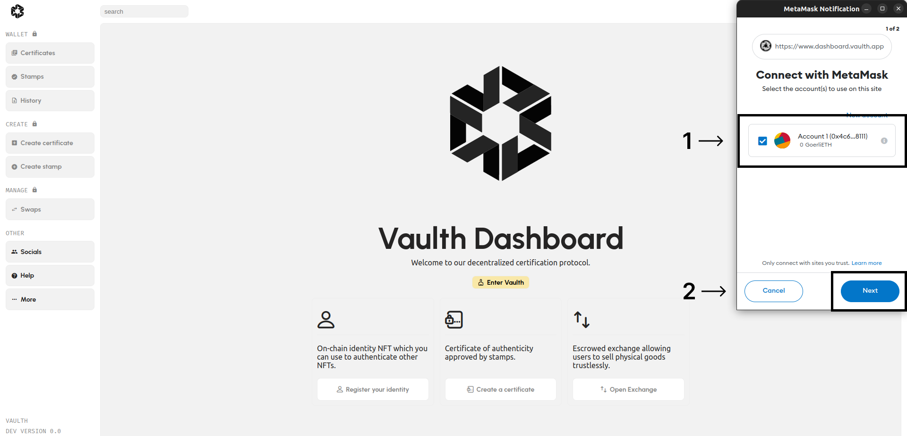
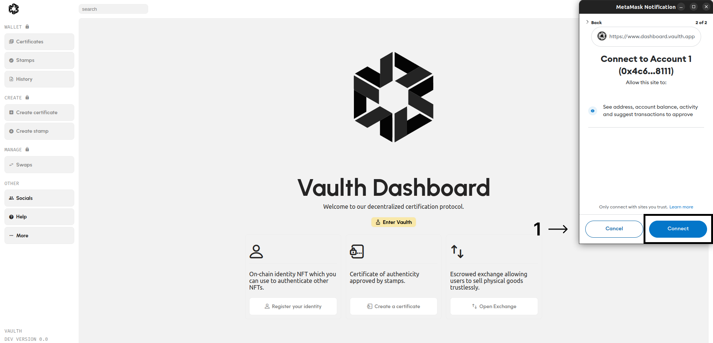
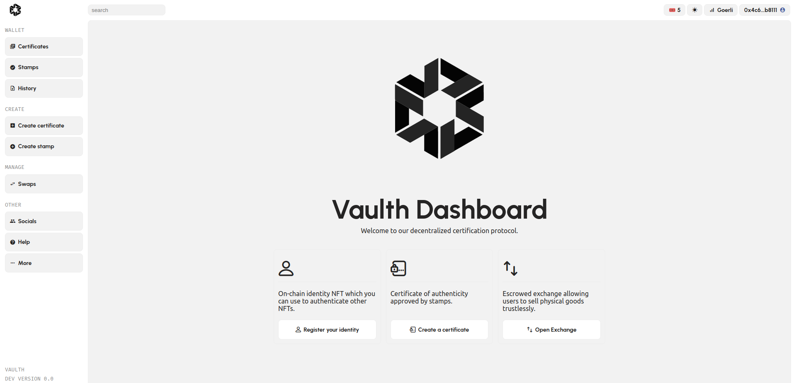

# Connect to Vaulth dashboard
### Why vaulth dashboard need you to connect with a crypto wallet ?
Vaulth is a web3 solution, that mean thanks to vaulth dashboard, you will be able to create stamps and certificates on the blockchain. 
This connectivity on the blockchain will give you garanty of security and transparency on the creation and transfer of your piece of art.

### Metamask browser extention (Recommended)
To connect on the dashboard you should have a Metamask account and the browser extention.
If you don't have, you can go [here](https://metamask.io/) to create one.

### Connection to the dashboard
Go to [vaulth dashboard](https://www.dashboard.vaulth.app) and click on "Connect wallet" or "Enter vaulth".
<figure><figcaption></figcaption></figure>

Select an account that you will connect with.
<figure><figcaption></figcaption></figure>

Click on connect to accept giving to vaulth dashboard your address, balances and activity wallet.
<figure><figcaption></figcaption></figure>

Great job, you are now connected on the vaulth dashboard !
<figure><figcaption></figcaption></figure>

You can start to create your first stamp by visiting the [next page](get-vaulth-stamp-voucher.md).