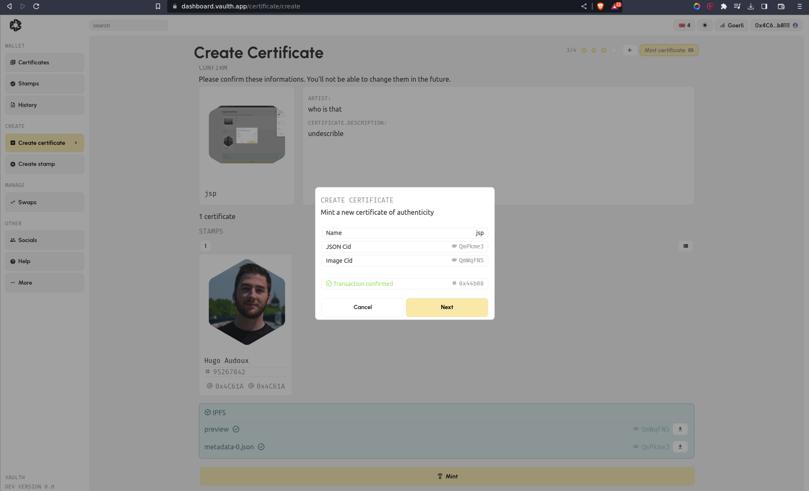

# Create my artwork certification

### Certify my artwork step by step
1. Login to the Vaulth dashboard and go to the create certificate page [here](https://www.dashboard.vaulth.app/certificate/create).

2. Fill all information part about your piece of art:
- Picture
- title
- artist name
- description
- other field like dimension or technique.
<figure><figcaption></figcaption></figure>

3. Choose a stamp between all yours to sign your new certificate.
<figure><figcaption></figcaption></figure>

<figure><figcaption></figcaption></figure>

4. Once you have pick one you can click to check all your information before minting the certificate. Some informations will not be able to change after minting.

<figure><figcaption></figcaption></figure>

5. You can now click on the Mint button and also on create to finalised your certificate.

<figure><figcaption></figcaption></figure>

<figure><figcaption></figcaption></figure>

6. A pop up from your Metamask extension will appear, and you have to confirm the transaction.

<figure><figcaption></figcaption></figure>

<figure><figcaption></figcaption></figure>

6. You have to wait a few seconds for the confirmation message, it will appear if the transaction was successful.

<figure><figcaption></figcaption></figure>

### Find my new certificate
You will be able to find you new certificate on your [certificate library](https://www.dashboard.vaulth.app/library/certificates).

### Issues with certificate creation ?
You can click [here](../help/contact-vaulth-support.md) to being redirect into the help page.
