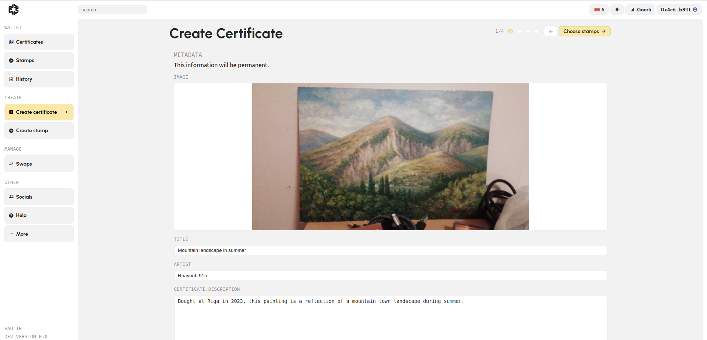
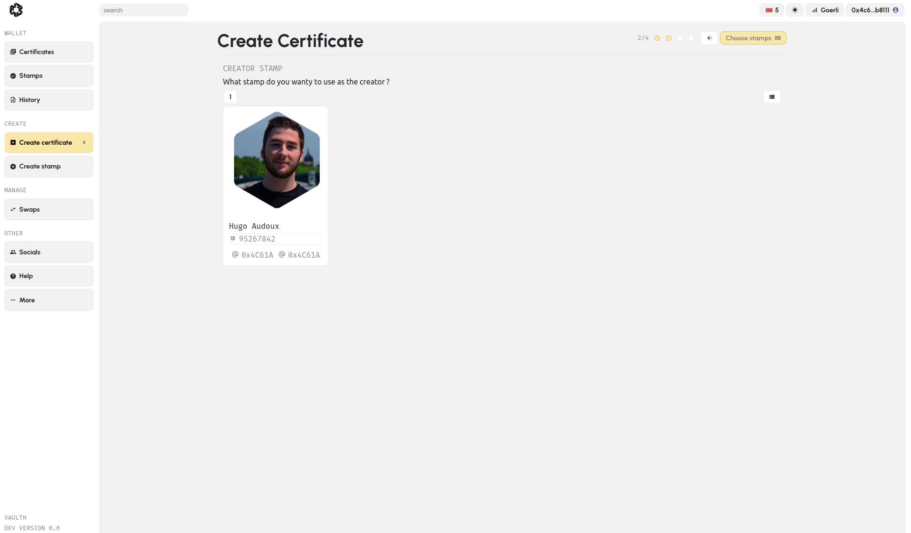
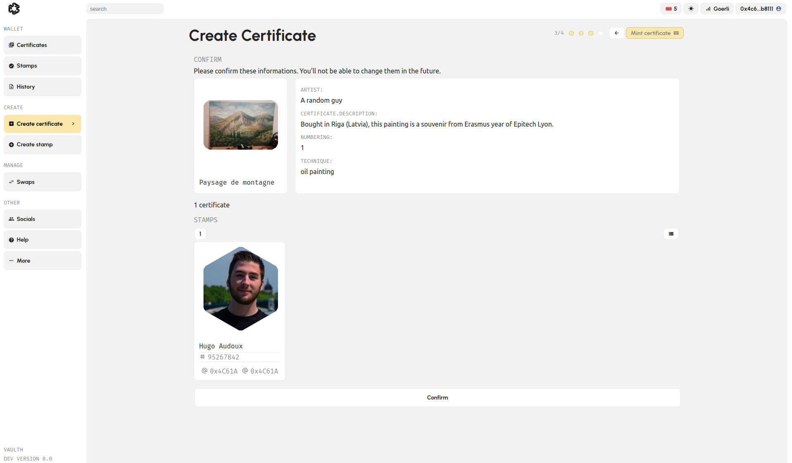
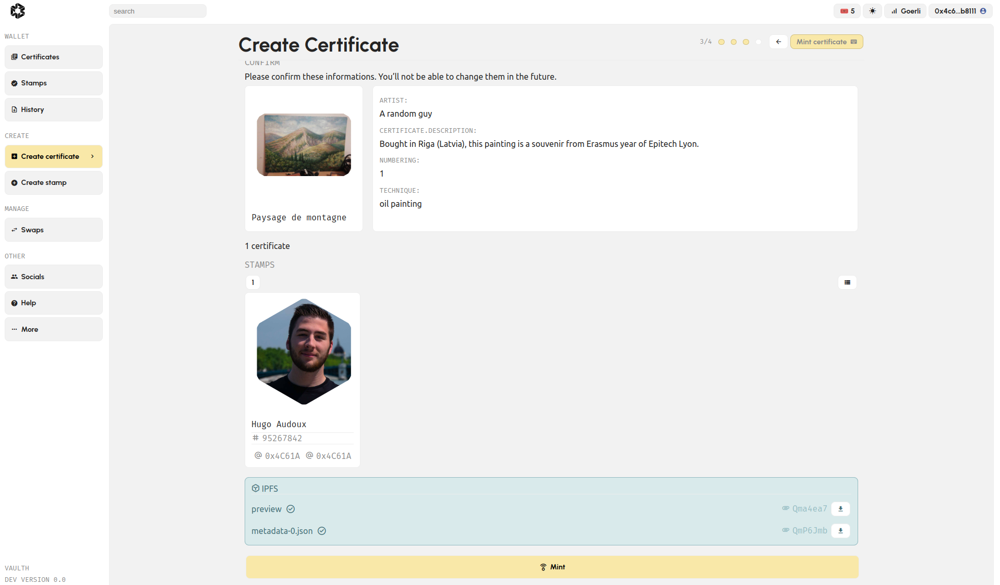
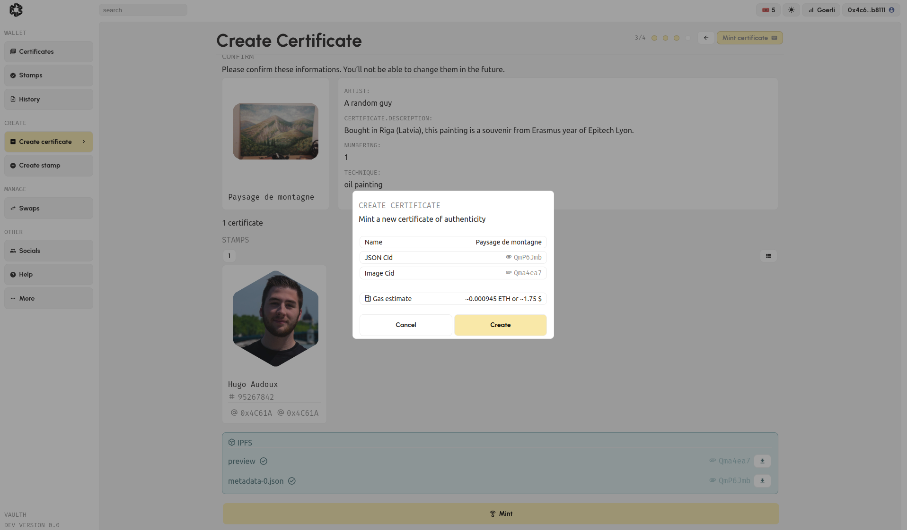
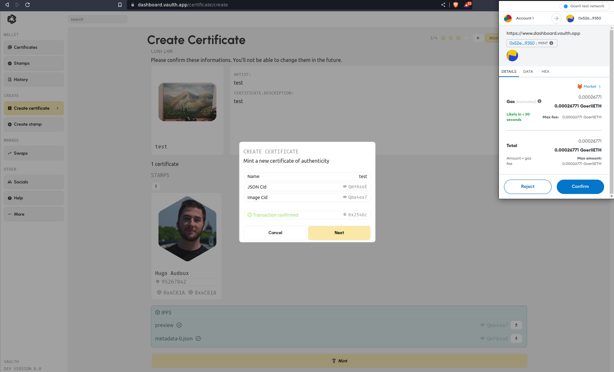
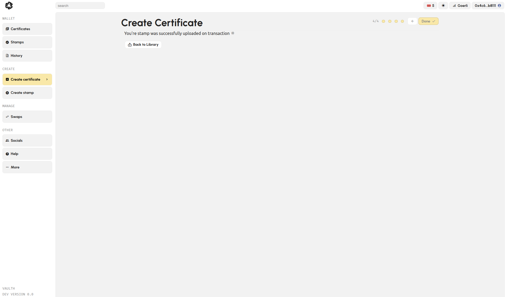

# Create My Artwork Certification

## Certify Your Artwork - Step by Step

1. **Log into the Vaulth Dashboard**: Start by logging in to the Vaulth dashboard. Navigate to the "Create Certificate" page by clicking [here](https://www.dashboard.
2. vaulth.app/certificate/create).

3. **Fill in Artwork Details**: Provide all the necessary information about your artwork, including:
   - Artwork Picture
   - Title
   - Artist Name
   - Description
   - Additional details like dimensions or technique.
   
   
4. **Select a Stamp**: Choose one of your stamps to sign your new certificate.
   
   

5. **Review Information**: Before finalizing your certificate, review all the entered information. Some details may not be changeable after minting.
   
   

6. **Mint and Create**: Click on the "Mint" button and then "Create" to complete your certificate.
   
   
   

7. **Confirm Transaction**: A pop-up from your Metamask extension will appear. Confirm the transaction.
   
   

8. **Wait for Confirmation**: Wait for a few seconds for the confirmation message. It will appear if the transaction was successful.
   
   

## Finding Your New Certificate

You can access your newly created certificate in your [certificate library](https://www.dashboard.vaulth.app/library/certificates).

## Encountering Issues with Certificate Creation?

If you encounter any issues during the certificate creation process, please [click here](../help/contact-vaulth-support.md) to be redirected to our help page for 
further assistance.
