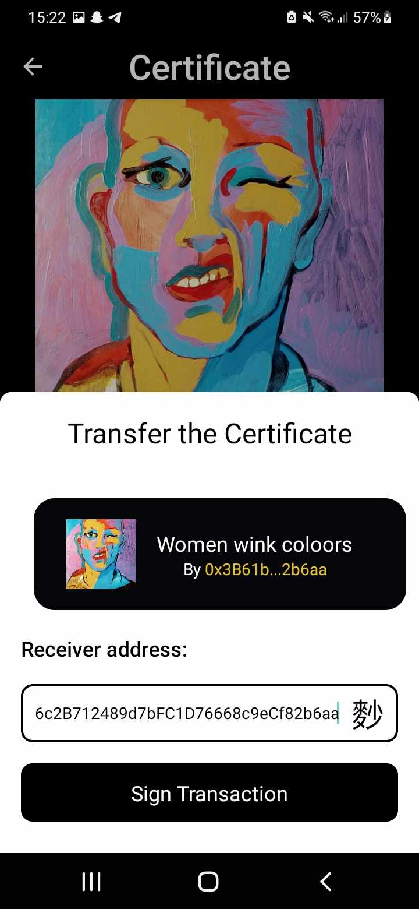

# Download the app from the vitrine website
Get access to the [Vitrine website](https://vaulth.app/) and click on the mobile app button:
<figure><figcaption></figcaption></figure>

# Rename the zip file into vaulth.apk
Rename the zip file from your download folder to vaulth.apk:

<figure><figcaption></figcaption></figure>

# Install the vaulth.apk on your phone
Now click on the vaulth.apk file and download the app on your phone:

<figure><figcaption></figcaption></figure>

# Connect on mobile and Link to a Physical Artwork

To link a certificate to your physical artwork, follow these steps using the Vaulth mobile app:

1. **Open the Vaulth Mobile App**: Launch the Vaulth mobile app on your device.

<figure><figcaption></figcaption></figure>
<figure><figcaption></figcaption></figure>
<figure><figcaption></figcaption></figure>

2. **Navigate to Your Owned Certificates**: On the app's home page, locate and select the certificate you wish to link to your physical artwork. This will open up the 
certificate details.

<figure><figcaption></figcaption></figure>

3. **Click on "Write on Tag"**: Click on the "WriteonTag" button. An action sheet will open, providing you with further options.

4. **Bring Your Phone to the NFC Tag**: Hold your phone close to the NFC tag that you want to link to your certificate. Ensure that the NFC tag is in close proximity 
to your device.

**Click on "Scan a Tag"**: Look for the "Scan a Tag" button on the search page and click it.
   
<figure><figcaption></figcaption></figure>

5. **Scan the NFC Tag**: Hold your device close to the NFC tag you want to scan. The app will automatically detect and interact with the tag.

<figure><figcaption></figcaption></figure>
<figure><figcaption></figcaption></figure>

6. **Transfer your certificate**: Click on The transfer button into a certificate page to open the transfer action sheet, fill the receiver address manually and click on transfer.

<figure><figcaption></figcaption></figure>
<figure><figcaption></figcaption></figure>

