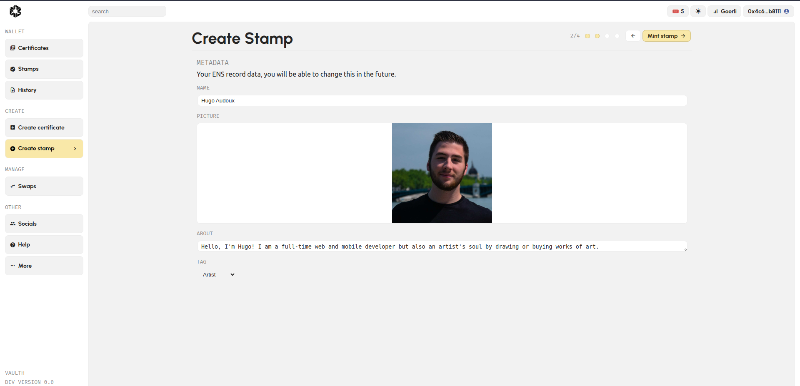
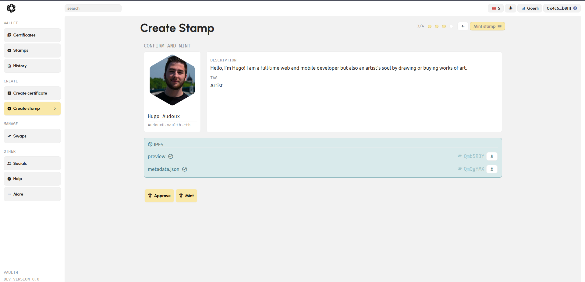
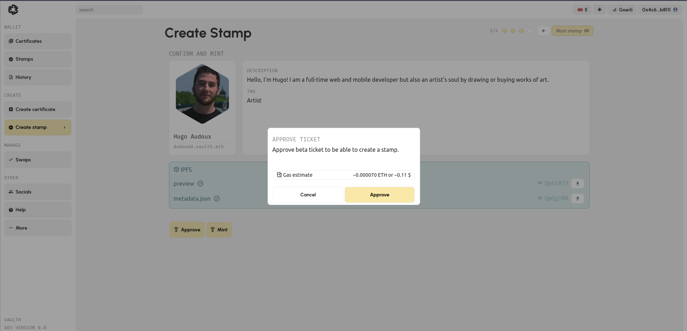
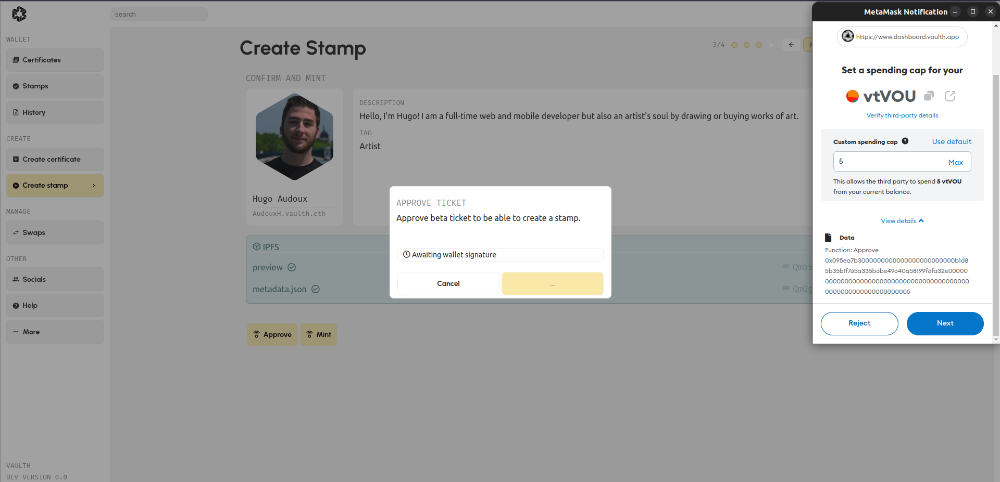
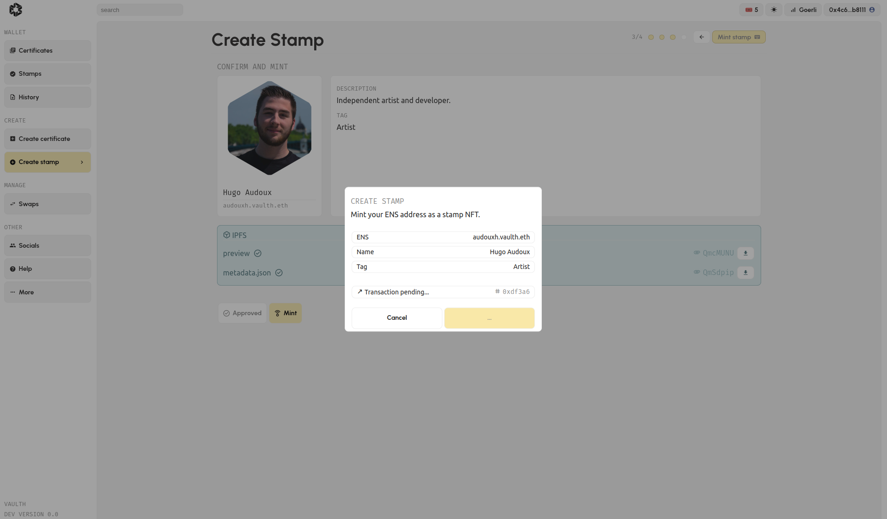
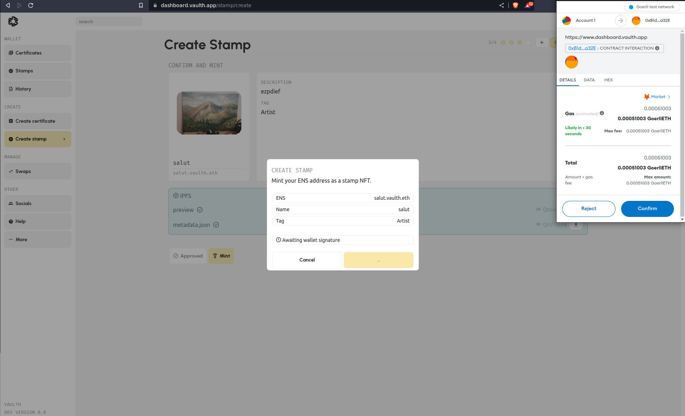
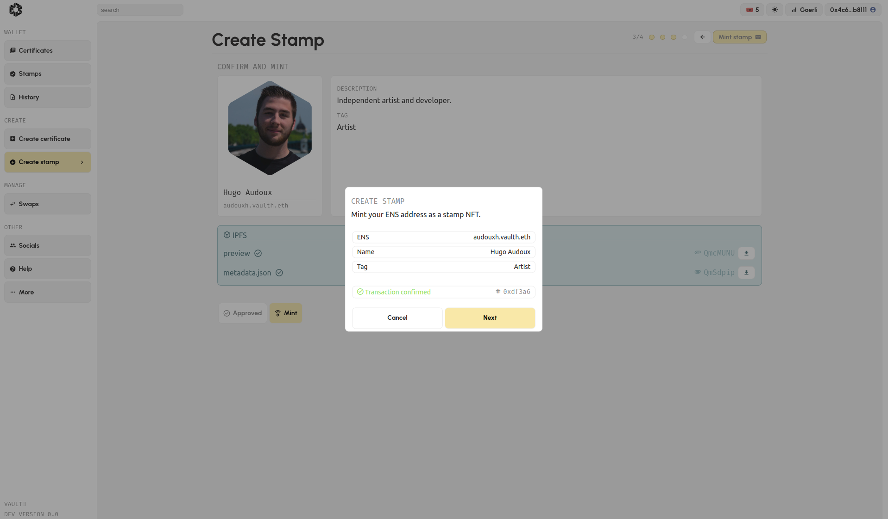
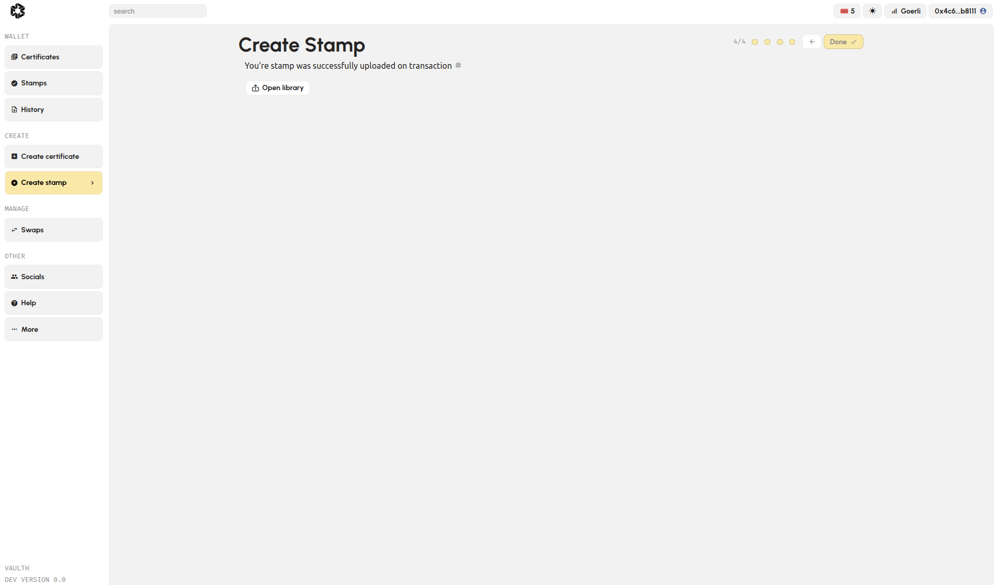
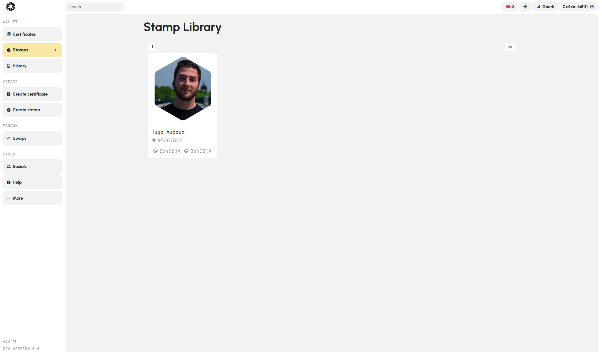

# Register my personal stamp

### Why do i need to create a stamp to certify my artwork ?
As explain before, a stamp is a representation of an entity that you want to represent (person, institution, company, etc...). 
A stamp can be use to create certificates but also proof your approval of authenticity.

### Create my personal stamp step by step
1. Login to the vaulth dashboard and go to the create stamp page [here](https://www.dashboard.vaulth.app/stamp/create).

2. Register your [ENS](https://iq.wiki/wiki/ens) subdomaine name to be sure that your stamp is unique and authentic. 
You can fill your [ENS](https://iq.wiki/wiki/ens) subdomaine name by your artist nickname or you company name. 
Once you have filled your [ENS](https://iq.wiki/wiki/ens), you can click on "add metadata". 

<figure><figcaption></figcaption></figure>
---- Photo du screen [ENS](https://iq.wiki/wiki/ens) avec fleche 1 qui pointe vers input ens et fleche 2 qui pointe vers button add metadata.

3. You can now fill all the data require to create your stamp like:
- the name
- the picture of you or the logo of your company
- a brief description of what kind of entity the stamp is supposed to represent
- a tag chosen between Artist, Art gallery, Museum or Editor. 
Once you have filled all your data, you can click on "Mint stamp". 

<figure><figcaption></figcaption></figure>
---- Photo screen du form rempli avec fleche 1, 2, 3, 4 pour remplir info et 5 sur le button Mint stamp.

4. Before going further, you should check your [ENS](https://iq.wiki/wiki/ens) subdomaine name (you will not be able to change it after the stamp is minted).
<figure><figcaption></figcaption></figure>

5. Once you are sure about your information you can click on the "Approve" button and on "Broadcast transaction" to confirm the transaction with your Wallet. 
Once the mint is approved, click on the "Mint" button to mint your stamp. 
<figure><figcaption></figcaption></figure>
<figure><figcaption></figcaption></figure>

6. Now that you have approved your stamp, you can click on the Mint button and create your stamp. 
<figure><figcaption></figcaption></figure>

7. Confirm the Metamask transaction to finalize your stamp
<figure><figcaption></figcaption></figure>
<figure><figcaption></figcaption></figure>

8. You have to wait a few seconds for the confirmation message, it will appear if the transaction was successful.
<figure><figcaption></figcaption></figure>

### Find my new personal stamp
You will be able to find you new stamp on your [stamp library](https://www.dashboard.vaulth.app/library/stamps).
<figure><figcaption></figcaption></figure>

### Issues with stamp registering ?
You can click [here](../help/contact-vaulth-support.md) to being redirect into the help page.