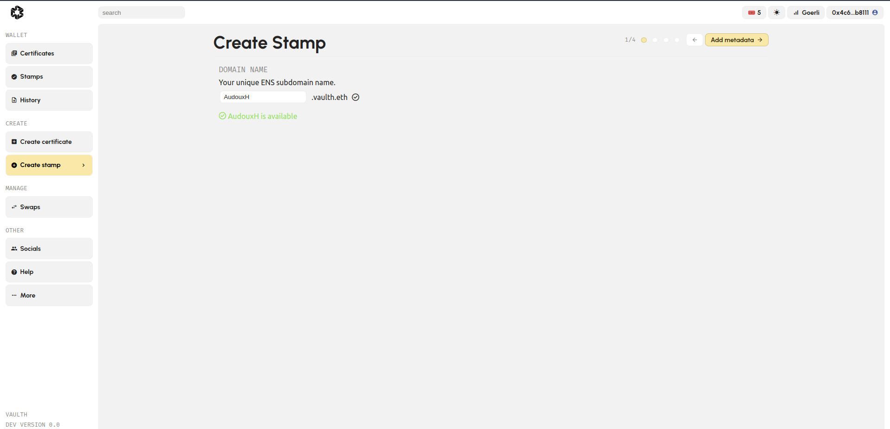

# Register My Personal Stamp

## Why Do I Need to Create a Stamp to Certify My Artwork?

As explained earlier, a stamp is a representation of an entity you want to represent (a person, institution, company, etc.). A stamp can be used to create 
certificates and provide proof of your approval of authenticity.

## Create My Personal Stamp - Step by Step

1. **Log into the Vaulth Dashboard**: Begin by logging in to the Vaulth dashboard. Access the "Create Stamp" page by clicking [here](https://www.dashboard.vaulth.app/stamp/create).

2. **Register Your [ENS](https://iq.wiki/wiki/ens) Subdomain Name**: Ensure the uniqueness and authenticity of your stamp by registering your [ENS](https://iq.wiki/wiki/ens) subdomain name. You can use your artist nickname or your company name as the [ENS](https://iq.wiki/wiki/ens) subdomain name. After entering your [ENS](https://iq.wiki/wiki/ens) subdomain name, click "Add Metadata."
   

3. **Complete Stamp Information**: Fill in all the required data to create your stamp, including:
   - Name
   - Picture (your photo or your company logo)
   - A brief description of the entity the stamp represents
   - Choose a tag from Artist, Art gallery, Museum, or Editor. Once all the data is filled, click "Mint Stamp."
   

4. **Review [ENS](https://iq.wiki/wiki/ens) Subdomain Name**: Before proceeding, double-check your [ENS](https://iq.wiki/wiki/ens) subdomain name (you won't be able to change it after minting).
   

5. **Approve and Mint Stamp**: Click "Approve" and then "Broadcast Transaction" to confirm the transaction with your wallet. Once approved, click the "Mint" button to mint your stamp.
   
   

6. **Finalize Your Stamp**: After approving your stamp, click "Mint" to create your stamp.
   

7. **Confirm Metamask Transaction**: Confirm the Metamask transaction to complete your stamp.
   
   

8. **Wait for Confirmation**: Wait a few seconds for the confirmation message; it will appear if the transaction was successful.
   

## Finding My New Personal Stamp

You can access your newly created stamp in your [stamp library](https://www.dashboard.vaulth.app/library/stamps).
   

## Issues with Stamp Registration?

If you encounter any issues while registering your stamp, please [click here](../help/contact-vaulth-support.md) to be redirected to our help page.